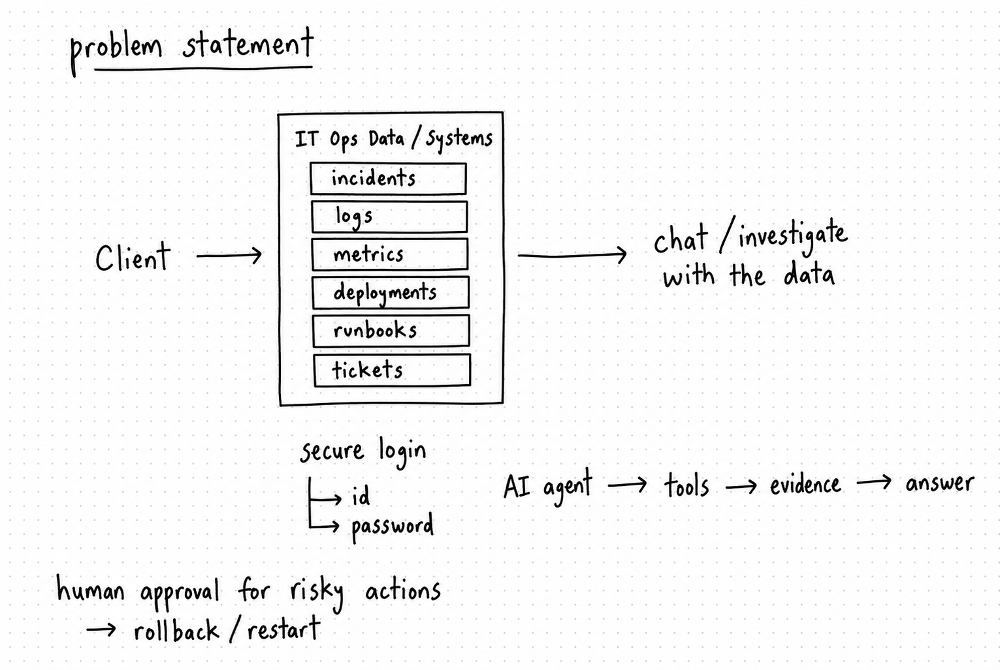

# OpsPilot

## AI-Powered IT Operations & Incident Response Copilot

> A secure, evidence-driven AI operations system that helps IT engineers investigate incidents across structured operational data, application logs, telemetry, deployment history, runbooks, and incident tickets, while keeping humans in control of high-impact actions.

---

## Table of Contents

- [1. Project Overview](#1-project-overview)
- [2. The Business Problem](#2-the-business-problem)
- [3. The FDE Mindset Behind OpsPilot](#3-the-fde-mindset-behind-opspilot)
- [4. What OpsPilot Is](#4-what-opspilot-is)
- [5. What OpsPilot Is Not](#5-what-opspilot-is-not)
- [6. Goals and Success Criteria](#6-goals-and-success-criteria)
- [7. Target Users](#7-target-users)
- [8. Core User Journey](#8-core-user-journey)
- [9. High-Level Architecture](#9-high-level-architecture)
- [10. End-to-End Request Flow](#10-end-to-end-request-flow)
- [11. Data Architecture](#11-data-architecture)
- [12. Data Sources and Why Each Exists](#12-data-sources-and-why-each-exists)
- [13. Backend Architecture](#13-backend-architecture)
- [14. Natural-Language Copilot](#14-natural-language-copilot)
- [15. Agent and LangGraph Orchestration](#15-agent-and-langgraph-orchestration)
- [16. Tool Calling and Tool Registry](#16-tool-calling-and-tool-registry)
- [17. SQL and Operational Database Access](#17-sql-and-operational-database-access)
- [18. Log Analysis](#18-log-analysis)
- [19. Metrics and Monitoring](#19-metrics-and-monitoring)
- [20. Deployment Correlation](#20-deployment-correlation)
- [21. RAG and Knowledge Retrieval](#21-rag-and-knowledge-retrieval)
- [22. Incident Risk ML](#22-incident-risk-ml)
- [23. Multi-Turn Memory](#23-multi-turn-memory)
- [24. Evidence, Citations, and Grounded Responses](#24-evidence-citations-and-grounded-responses)
- [25. Ticket Workflow](#25-ticket-workflow)
- [26. Human Approval and Safe Actions](#26-human-approval-and-safe-actions)
- [27. Security Architecture](#27-security-architecture)
- [28. Authentication and RBAC](#28-authentication-and-rbac)
- [29. Audit Logging](#29-audit-logging)
- [30. Observability](#30-observability)
- [31. Docker and Containerization](#31-docker-and-containerization)
- [32. AWS Deployment](#32-aws-deployment)
- [33. GitHub Actions CI/CD](#33-github-actions-cicd)
- [34. Database Migrations](#34-database-migrations)
- [35. Testing Strategy](#35-testing-strategy)
- [36. AI Evaluation Strategy](#36-ai-evaluation-strategy)
- [37. Effectiveness and Validation](#37-effectiveness-and-validation)
- [38. Golden-Path Example](#38-golden-path-example)
- [39. Why the Architecture Is Effective](#39-why-the-architecture-is-effective)
- [40. Failure Handling](#40-failure-handling)
- [41. Project Structure](#41-project-structure)
- [42. Local Development](#42-local-development)
- [43. Deployment Workflow](#43-deployment-workflow)
- [44. Environment and Secrets](#44-environment-and-secrets)
- [45. Security Rules](#45-security-rules)
- [46. Current Implementation Status](#46-current-implementation-status)
- [47. Known Limitations and V2](#47-known-limitations-and-v2)
- [48. FDE Case Study](#48-fde-case-study)
- [49. Interview Explanation](#49-interview-explanation)
- [50. Project Glossary](#50-project-glossary)
- [51. Final Summary](#51-final-summary)

---

# 1. Project Overview

## What is OpsPilot?

OpsPilot is an AI-powered IT operations and incident response system designed around one practical problem:

> **Engineers should not have to manually search several systems before they can understand one production incident.**

In a typical operations environment, information about the same incident is distributed across:

- incident records
- service and deployment history
- application logs
- monitoring metrics
- traces
- operational databases
- internal runbooks and SOPs
- remediation tickets

OpsPilot brings those systems together behind a controlled AI Copilot.

The user interacts with OpsPilot primarily through **natural language**. The system decides what information is required, calls approved tools, validates what it receives, combines evidence, applies an incident-risk model where appropriate, retrieves internal knowledge, and produces an explanation with evidence.

The dashboard/control-tower UI is the supporting interface. The core product is the **investigation system**, not merely the chat screen.

---

# 2. The Business Problem

## The original client problem

The project starts from a business requirement rather than a technology requirement:

> Support and operations engineers spend too much time investigating incidents because they have to manually search monitoring systems, logs, databases, deployment records, tickets, and internal runbooks. The organization wants an AI assistant that speeds up investigation while keeping humans in control of risky actions.

<div align="center">
  
  <p><em>Figure 1: Problem Statement — Fragmented IT Operations data unified behind a secure AI Copilot with human approval for sensitive actions.</em></p>
</div>

The client does **not** start by asking for LangGraph, a vector database, or an LLM.

The correct FDE sequence is:

```text
Business Problem
      ↓
Business Requirements
      ↓
Users + Use Cases
      ↓
Success Metrics
      ↓
Technical Architecture
      ↓
Implementation
      ↓
Security
      ↓
Testing + Evaluation
      ↓
Deployment
      ↓
Observability + Operations
```

## Existing/manual investigation pattern

Without OpsPilot, an engineer might need to do this manually:

```text
Incident ticket
    ↓
Monitoring dashboard
    ↓
Application logs
    ↓
Database investigation
    ↓
Recent deployment history
    ↓
Runbook search
    ↓
Team discussion
    ↓
Manual incident summary
    ↓
Ticket creation/update
```

The problem is not that any single system is bad. The problem is that the **investigation workflow is fragmented**.

## Business impact the system targets

OpsPilot is designed to reduce:

- manual investigation effort
- context switching between systems
- repeated troubleshooting work
- difficulty finding the correct internal procedure
- inconsistent incident investigation workflows
- delayed escalation and ticket updates

The project uses measurable targets rather than claiming that these improvements already exist in a real company.

---

# 3. The FDE Mindset Behind OpsPilot

OpsPilot is intentionally designed as a **Forward Deployed Engineer style project**.

The FDE mindset is not:

> "I know a framework, so I need to build something with it."

It is:

> "A user has an operational problem. What is the simplest secure system that solves it, and how do I prove that it works?"

This project therefore covers the full lifecycle:

### Discovery

Understand the user, problem, workflow, constraints, and success criteria.

### Design

Choose architecture and data contracts based on those requirements.

### Build

Implement the data layer, backend, AI layer, tools, UI, security, and evaluation.

### Deploy

Package the system, move it to AWS, and make deployment repeatable.

### Operate

Add health checks, logs, telemetry, auditability, failure handling, and CI/CD.

### Measure

Evaluate not only application uptime, but also AI behavior, retrieval quality, tool behavior, security, and operational usefulness.

---

# 4. What OpsPilot Is

OpsPilot is a **secure incident investigation and response system** with a natural-language Copilot at its center.

It provides:

1. user authentication
2. role-based access control
3. incident investigation
4. SQL-backed operational lookup
5. application log search
6. metrics lookup
7. deployment correlation
8. runbook retrieval with RAG
9. incident-risk prediction
10. agentic tool routing
11. multi-turn conversational memory
12. evidence-backed answers
13. ticket creation and updates
14. human approval for sensitive actions
15. audit logging
16. observability
17. automated testing
18. AI evaluation
19. Docker-based packaging
20. AWS deployment
21. GitHub Actions CI/CD

---

# 5. What OpsPilot Is Not

The project deliberately does **not** define the LLM as:

```text
LLM = DBA                  ❌
LLM = root user            ❌
LLM = production operator  ❌
LLM = unrestricted executor ❌
```

The LLM is a **reasoning component inside controlled boundaries**.

The V1 system is also not intended to be:

- an autonomous production-remediation engine
- a full Kubernetes control plane
- a replacement for Jira or ServiceNow
- a multi-agent research platform
- a fine-tuned foundation model
- a multi-region enterprise cloud platform

Those items can be considered V2 extensions after the core investigation system is stable.

---

# 6. Goals and Success Criteria

## Business goals

The core business target is to reduce the effort and time required to investigate incidents.

Example project target:

```text
Manual investigation target:      ~20 minutes
OpsPilot-assisted target:         <10 minutes
```

These are **project targets for experimental validation**, not claims about an external organization's measured baseline.

## AI goals

Measure:

- answer correctness
- tool selection accuracy
- retrieval quality
- SQL success rate
- unsupported-claim rate
- citation validity
- hallucination/grounding behavior

## System goals

Measure:

- API latency
- agent latency
- tool latency
- database response time
- failure rate
- health-check success

## Security goals

Verify that:

- unauthorized access is blocked
- unsafe SQL is blocked
- unauthorized tools cannot run
- sensitive actions require approval
- important actions generate audit records

---

# 7. Target Users

## L1 Support Engineer

Needs fast operational context.

Typical questions:

```text
What is failing?
Which service is affected?
What is the current severity?
What should I check next?
```

## L2 / DevOps Engineer

Needs deeper technical investigation.

Typical questions:

```text
What changed recently?
What do the application logs show?
Are database connections saturated?
Did a deployment correlate with the failure?
What does the runbook recommend?
```

## IT Operations Manager

Needs higher-level visibility.

Typical questions:

```text
How many incidents are active?
Which services are producing repeated failures?
Which incidents need escalation?
How quickly are incidents being resolved?
```

The same underlying data supports all three users, but the **information need and authorization boundary differ**.

---

# 8. Core User Journey

The primary V1 journey is:

```text
User logs in
     ↓
Dashboard / Incident view
     ↓
Select or identify incident
     ↓
Ask a natural-language question
     ↓
OpsPilot understands intent
     ↓
Determines required information
     ↓
Selects approved tools
     ↓
Executes tools
     ↓
Validates tool results
     ↓
Correlates evidence
     ↓
Retrieves runbook knowledge if needed
     ↓
Uses ML risk signal when useful
     ↓
LLM synthesizes grounded response
     ↓
Shows evidence / citations / tool trace
     ↓
User decides what to do next
     ↓
Ticket can be created or updated
     ↓
Sensitive actions require human approval
     ↓
Important actions are audited
```

This is the main product experience.

---

# 9. High-Level Architecture

```text
                           ┌────────────────────────────┐
                           │         User / Engineer    │
                           └──────────────┬─────────────┘
                                          │
                              Natural-language question
                                          │
                                          ▼
                           ┌────────────────────────────┐
                           │     Web Application / UI   │
                           │     React + Vite + Nginx   │
                           └──────────────┬─────────────┘
                                          │
                                          ▼
                           ┌────────────────────────────┐
                           │       FastAPI Backend      │
                           │ Auth / API / Chat / Tools  │
                           └──────────────┬─────────────┘
                                          │
                         ┌────────────────┼────────────────┐
                         │                │                │
                         ▼                ▼                ▼
                ┌────────────────┐ ┌──────────────┐ ┌──────────────┐
                │ Agent /        │ │ Security /   │ │ Session /    │
                │ LangGraph      │ │ RBAC / Audit │ │ Chat Memory  │
                └───────┬────────┘ └──────────────┘ └──────────────┘
                        │
             ┌──────────┼───────────┬────────────┬─────────────┐
             │          │           │            │             │
             ▼          ▼           ▼            ▼             ▼
         SQL Tool    Log Tool   Metrics Tool  Deployment     RAG Tool
             │          │           │           Tool           │
             ▼          ▼           ▼            ▼             ▼
        PostgreSQL    Logs/API   Metrics/API  Deployment   Vector Store
                                                      │
                                                      ▼
                                                Runbook / SOPs
                        
                         ┌──────────────────────────────┐
                         │ Incident Risk ML Model       │
                         │ Random Forest / XGBoost      │
                         └──────────────────────────────┘

                         ┌──────────────────────────────┐
                         │ Ticket Tool                  │
                         │ Create / Update              │
                         └──────────────────────────────┘

                         ┌──────────────────────────────┐
                         │ Observability                 │
                         │ OTel + Prometheus + Grafana  │
                         └──────────────────────────────┘
```

## Architecture principle

Each subsystem has a focused responsibility.

The AI does not directly control every underlying system. Instead, the AI interacts through **registered tools and policy boundaries**.

---


## Technology and Concept Master Map

| Topic / Concept | What it is | Why OpsPilot uses it | How it works in OpsPilot | What effectiveness means |
|---|---|---|---|---|
| Business requirements | Formal description of the customer problem and expected outcomes | Prevents technology-first design | Problem → users → workflows → requirements → metrics | The solution addresses a defined operational problem |
| FDE approach | End-to-end problem solving across customer context and engineering | Keeps the project focused on delivery and adoption | Discover → design → build → deploy → operate → measure | The system can be explained as a complete customer solution |
| PostgreSQL | Relational database | Stores structured enterprise-style operational records | Tables, relations, indexes, constraints, transactions | Correct, consistent and queryable operational data |
| SQL | Declarative query language | Answers deterministic structured questions | Tools execute approved read-oriented queries | Correct query results with safe access |
| FastAPI | Python web framework | Provides the backend service boundary | HTTP routes → validation → business logic → tools | Reliable APIs, clear contracts and health endpoints |
| React / Vite | Web UI stack | Provides the engineer-facing Copilot and control-tower interface | Browser → frontend API calls → backend | Users can investigate without directly touching underlying systems |
| LLM | Large language model | Understands natural-language requests and synthesizes evidence | User message + validated context → response | Useful, grounded explanations rather than unsupported text |
| Prompting | Instructions/context given to the LLM | Shapes response behavior and tool-use behavior | System instructions + user request + evidence | Consistent, bounded agent behavior |
| Tool calling | Structured invocation of application capabilities | Separates reasoning from execution | Agent selects registered tool → tool runs → result returns | Correct tool choice and controlled execution |
| Tool registry | Explicit inventory of tools available to the agent | Creates a security and engineering boundary | Tools are registered with defined inputs/outputs/permissions | Only intended capabilities can be invoked |
| LangGraph | Graph-based agent orchestration | Manages stateful, multi-step investigations | Nodes + transitions + tool calls + state | Predictable, traceable multi-step workflows |
| Agent state | Structured information carried across a run | Allows the agent to remember investigation context | State is updated after each step/tool | Follow-up questions retain the right context |
| Multi-turn memory | Conversation continuity | Users should not repeat the incident every turn | Session + persisted messages + context | Correct follow-up behavior across turns |
| RAG | Retrieval-Augmented Generation | Brings internal runbooks into the AI context | Documents → chunks → embeddings → vector search → LLM | Relevant evidence is retrieved and cited |
| Embeddings | Vector representation of text | Enables semantic document retrieval | Text chunk → embedding vector → similarity search | Relevant runbooks rank highly |
| Vector store | Searchable storage for embedding vectors | Supports semantic lookup of runbooks | Query embedding → similarity search → candidates | Useful retrieval with low irrelevant-result rate |
| Relevance threshold | Minimum retrieval quality boundary | Prevents weak matches from being treated as evidence | Candidate score → threshold → accept/reject | Fewer unsupported knowledge-grounding errors |
| RAG grounding | Connecting generated claims to retrieved evidence | Reduces unsupported operational recommendations | Retrieved evidence is supplied to response generation | Important claims have support |
| Citations | Visible source references | Makes answers inspectable | Evidence source metadata → UI citation | Users can verify where a recommendation came from |
| Log analysis | Examination of application/system events | Exposes detailed failure signatures | Search → filter → normalize → correlate | Relevant error evidence appears quickly |
| Log parsing | Converts raw logs into structured records | Makes logs queryable and analyzable | Raw line → timestamp/service/level/message/trace fields | Stable and searchable log representation |
| Metrics | Numeric measurements of system behavior | Shows trends and system state | Query service metrics and time windows | Trends support or challenge hypotheses |
| Traces | Distributed request-flow telemetry | Helps understand cross-service behavior | Instrumentation → propagation → collection → inspection | Causal paths become easier to inspect |
| OpenTelemetry | Observability instrumentation/collection framework | Connects distributed application telemetry to the system | Services emit telemetry → collector receives/processes it | Telemetry is available for operational investigation |
| Prometheus | Metrics storage/query layer | Supports monitoring and operational dashboards | Scrape/store → query metrics | Service health and trends are measurable |
| Grafana | Observability visualization layer | Makes telemetry easier to inspect | Dashboards query monitoring data | Engineers can see system behavior and anomalies |
| Incident correlation | Linking related operational events | Turns isolated records into an investigation narrative | Deployment + telemetry + logs + incident + ticket | Evidence aligns across sources |
| Temporal correlation | Comparing event timing | Helps assess whether a change preceded a failure | Event timestamps are compared | Faster identification of plausible recent changes |
| ML risk prediction | Supervised/pattern-based incident risk signal | Adds a quantitative triage signal | Feature vector → tree model → risk score/class | Risk signal is validated independently and not treated as proof |
| Random Forest | Ensemble tree-based ML model | Provides a practical baseline for tabular incident risk | Multiple decision trees vote/average | Stable predictive signal on evaluated data |
| XGBoost | Gradient-boosted tree model | Provides a stronger comparative model candidate | Sequentially improves tree ensemble errors | Useful benchmark against baseline models |
| Feature engineering | Conversion of raw operational data into model inputs | Makes operational signals usable by ML | Logs/metrics/incident state → numerical/categorical features | Features are meaningful and evaluation is repeatable |
| Ticket workflow | Structured incident follow-up record | Converts investigation into operational tracking | Agent → authorized ticket tool → PostgreSQL | Ticket is persisted and linked to incident context |
| Human-in-the-loop | Human approval in an AI workflow | Prevents high-impact actions from being purely model-driven | Recommend → authorize → human approve → execute | Sensitive actions remain controlled and auditable |
| RBAC | Role-Based Access Control | Different users need different permissions | User role → allowed routes/tools/actions | Unauthorized actions are blocked |
| Authentication | Identity verification | Protects the system from anonymous access | Credentials/token → authenticated session | Protected resources require valid identity |
| Least privilege | Giving only required permissions | Limits blast radius | Separate roles/credentials/tool permissions | Sensitive capabilities are narrowly scoped |
| SQL safety | Controls database operations available to the agent | Prevents destructive data operations | Read-only role + validation + controlled tool | Unsafe operations are rejected |
| Audit logging | Persistent record of important actions | Supports accountability and investigation | Actor + action + target + result + time | Actions can be reconstructed later |
| Health checks | Automated service liveness/readiness validation | Detects broken deployments | Container/API probe → success/failure | Failed deployments do not appear healthy |
| Docker | Container packaging technology | Makes environments repeatable | Image build → container runtime | Local/CI/AWS behavior stays closer together |
| Docker Compose | Multi-container orchestration | Runs the full OpsPilot stack as one application | Services + dependencies + volumes + network | All required components can be started consistently |
| Nginx | Web server/reverse proxy | Serves frontend assets and proxies backend API traffic | Browser → Nginx → static assets/API proxy | Stable frontend delivery and routing |
| AWS EC2 | Virtual compute instance | Hosts the selected live demo deployment | EC2 → Docker Engine → Compose stack | The application is reachable and operable in cloud runtime |
| GitHub Actions | CI/CD automation platform | Automates build, test and deployment | Git push → workflow → validation → deployment | Releases become repeatable rather than manual |
| CI | Continuous Integration | Finds regressions before deployment | Lint + security + tests + build | Failed changes are rejected before CD |
| CD | Continuous Deployment/Delivery automation | Moves validated code to the target environment | SSH/deployment workflow → EC2 → Compose | A code change can reach the running environment automatically |
| Database migration | Versioned schema change | Evolves the database safely | Migration files → migration runner → current schema | Existing data survives repeated releases |
| Migration idempotency | Safe repeated application of migration state | Persistent production DBs outlive application containers | Track/guard applied changes and use safe DDL patterns | Redeployments do not fail because an object already exists |
| Integration testing | Testing subsystem boundaries together | Finds failures that unit tests miss | API/DB/RAG/telemetry/tool integrations | Real dependencies behave correctly as a system |
| Golden-path testing | Testing the highest-value business journey | Proves the product works end to end | Login → investigation → correlation → RAG → ticket | The main user journey completes successfully |
| AI evaluation | Measuring model/agent behavior explicitly | AI correctness is different from API correctness | Tool accuracy + grounding + retrieval + response tests | Quality is demonstrated with measurable evidence |
| Failure handling | Explicit behavior when dependencies fail | Production dependencies are not always available | Timeout → retry/fallback → safe error → audit | System fails safely rather than inventing results |

---

# 10. End-to-End Request Flow

Suppose the engineer asks:

> **"Why is the Payment API failing? Please check incident #1."**

The request follows this sequence:

```text
1. User authenticated
       ↓
2. Chat API receives message
       ↓
3. Incident context is identified
       ↓
4. Agent interprets the request
       ↓
5. Agent decides investigation requires multiple sources
       ↓
6. get_incident()
       ↓
7. search_incident_events()
       ↓
8. get_recent_deployments()
       ↓
9. search_knowledge()
       ↓
10. Results are validated
       ↓
11. Evidence is combined
       ↓
12. ML risk score is available as a decision signal
       ↓
13. LLM produces grounded explanation
       ↓
14. Tool trace + evidence are exposed in the UI
       ↓
15. User may ask a follow-up
```

This is the difference between a simple LLM call and an **agentic investigation workflow**.

---

# 11. Data Architecture

OpsPilot uses multiple data types because incident investigation is inherently multi-source.

<div align="center">
  
  <p><em>Figure 2: PostgreSQL Central Database Architecture — Serving backend read/writes, frontend interactions, AI Agent tool retrieval, and monitoring telemetry storage.</em></p>
</div>

## Operational relational data

The main enterprise-style data model includes concepts such as:

```text
users
services
servers
teams
dependencies
deployments
incidents
incident_events
tickets
metrics / summaries
audit logs
chat messages
```

The project intentionally uses a realistic relational model instead of putting everything into one JSON file.

### Why PostgreSQL?

PostgreSQL is used because operational data has strong relationships and requires:

- constraints
- joins
- transactional writes
- indexed lookups
- consistent identifiers
- structured query semantics

For example:

```text
incident
   ↓
service
   ↓
deployment
   ↓
telemetry
   ↓
logs
   ↓
ticket
```

A relational database makes these relationships explicit.

---

# 12. Data Sources and Why Each Exists

OpsPilot intentionally does **not** depend on one dataset.

## 12.1 Synthetic enterprise operational data

The core operational database is generated by the project itself.

The project reached approximately:

```text
241,988 operational rows
```

Recorded counts included:

```text
app_logs          129,640
service_metrics    68,844
incident_events    35,780
audit_logs          5,070
tickets             1,223
deployments           817
incidents             604
services                6
users                   4
```

The exact proportions are less important than the purpose: the dataset is large enough to exercise joins, filtering, aggregation, search, agent tools, and operational correlations.

### Why synthetic enterprise data?

No single public dataset naturally provides consistent relationships among incidents, deployments, services, metrics, tickets, teams, and users.

Generating the dataset allows the project to control:

- schema
- volume
- causal relationships
- test cases
- edge cases
- reproducibility

### Important rule

Synthetic data is clearly treated as **project-generated operational data**, not as data belonging to a real company.

---

## 12.2 LogHub

LogHub is used as a source of public system log data for log analytics research and model experiments.

The intended flow is:

```text
Raw LogHub Logs
      ↓
Parsing / Structuring
      ↓
Normalized Log Records
      ↓
Feature Extraction
      ↓
Anomaly / Failure Analysis
      ↓
ML Evaluation
```

### Why LogHub?

The project needs real log patterns rather than only hand-written examples.

It supports experiments involving:

- log parsing
- anomaly detection
- failure signatures
- feature engineering
- model generalization

LogHub is not presented as the company's private production log system. It is a **public research data source used for development and evaluation**.

---

## 12.3 OpenTelemetry Demo / Astronomy Shop

OpenTelemetry is the observability technology.

The demo application provides a realistic distributed microservice environment that emits telemetry.

Conceptually:

```text
Microservices
     ↓
OpenTelemetry instrumentation
     ↓
Logs + Metrics + Traces
     ↓
Collector / Telemetry pipeline
     ↓
OpsPilot observability layer
```

### Why use it?

Static logs are not enough to demonstrate distributed systems investigation.

A realistic telemetry source makes it possible to reason about:

- request flow
- service dependencies
- latency
- failures
- distributed traces
- application behavior

The important distinction is:

> OpenTelemetry is the observability technology; the demo application is the controlled realistic workload that produces telemetry.

---

## 12.4 Internal runbooks and SOPs

Runbooks are deliberately created for the project and act as the internal knowledge base.

Examples include:

```text
database_incident_runbook.md
payment_api_runbook.md
deployment_rollback_sop.pdf
network_incident_sop.md
security_incident_response.pdf
api_latency_troubleshooting.md
database_connection_pooling.md
```

These documents answer questions such as:

```text
What should an engineer check first?
When should an incident be escalated?
What conditions justify rollback?
How should database pool saturation be investigated?
```

These documents become the source material for RAG.

---

## 12.5 Ticketing data

V1 uses an internal ticket data model so that ticket creation and updates can be tested without making the whole project dependent on an external service.

The architecture can later integrate with external issue systems such as GitHub Issues, Jira, or ServiceNow.

---

# 13. Backend Architecture

The backend uses **FastAPI** as the application and API layer.

Its responsibilities include:

- authentication
- authorization
- request validation
- incident APIs
- chat APIs
- tool execution
- database access
- RAG integration
- ML integration
- ticket workflow
- audit logging
- health checks

Conceptually:

```text
HTTP Request
    ↓
FastAPI route
    ↓
Authentication
    ↓
Authorization
    ↓
Validation
    ↓
Business service / Agent
    ↓
Tool or database
    ↓
Response
```

### Why FastAPI?

The project needs a clear service boundary between the frontend and backend AI/operations logic.

FastAPI provides:

- typed request/response models
- API routing
- validation
- easy local development
- a natural interface for tools and service integrations

---

# 14. Natural-Language Copilot

The Copilot is the primary interaction model.

The engineer should be able to ask questions in normal operational language rather than manually finding every data source.

Examples:

```text
Why is the Payment API failing?

Did the latest deployment cause it?

What do the logs show?

What does the runbook recommend?

Create a ticket for this incident.
```

The Copilot converts the question into a controlled investigation plan.

### What makes this different from a normal chatbot?

A normal chatbot may only generate text.

OpsPilot can:

```text
Understand
   ↓
Retrieve
   ↓
Call tools
   ↓
Correlate
   ↓
Validate
   ↓
Explain
   ↓
Take an authorized workflow action
```

The response is therefore connected to operational evidence rather than generated from conversation alone.

---

# 15. Agent and LangGraph Orchestration

LangGraph is used to represent the agent workflow as stateful steps rather than one uncontrolled prompt.

A simplified flow is:

```text
START
  ↓
Understand request
  ↓
Determine required context
  ↓
Select tool(s)
  ↓
Execute tool(s)
  ↓
Inspect result
  ↓
Need more information?
  ├── YES → select next tool
  └── NO  → synthesize answer
  ↓
Return evidence-backed response
  ↓
END
```

### Why an agent?

Because incident questions are often multi-step.

For example:

> "Did the latest deployment cause this outage?"

may require:

```text
Incident data
       +
Deployment history
       +
Error timing
       +
Logs / metrics
       ↓
Temporal correlation
```

A static answer template cannot handle that variability reliably.

### Why LangGraph instead of a single agent prompt?

The investigation needs:

- state
- predictable transitions
- tool routing
- memory
- error handling
- controlled execution
- auditable traces

The graph structure gives the application an explicit orchestration model.

---

# 16. Tool Calling and Tool Registry

The agent does not directly access every system.

It accesses **registered tools**.

Representative tools include:

### Read tools

```text
query_incidents
get_incident
search_logs
get_metrics
get_deployments
get_service
search_runbook
predict_incident_risk
```

### Write tools

```text
create_ticket
update_ticket
```

### Sensitive tools for controlled future/extended workflows

```text
request_rollback
restart_service
```

Sensitive tools are gated by authorization and human approval.

## Why tool calling?

It creates a boundary between reasoning and execution.

Instead of:

```text
LLM → arbitrary database/API access
```

we use:

```text
LLM
 ↓
Approved Tool
 ↓
Validation / Policy
 ↓
Specific Data Source
```

This makes tool use more testable, observable, and secure.

---

# 17. SQL and Operational Database Access

SQL is used for structured operational questions.

Examples:

```text
Find incident #1
List recent deployments for payment-api
Show active high-severity incidents
Count incidents by service
Find tickets associated with an incident
```

### Why SQL?

The operational database contains structured relationships that are more reliably answered using deterministic queries than by asking an LLM to infer data from text.

### Security model

The investigation path is read-only for operational SQL whenever possible.

Conceptually:

```text
User
 ↓
Agent
 ↓
SQL Tool
 ↓
Query validation
 ↓
Read-only database credentials
 ↓
PostgreSQL
```

The agent is not granted unrestricted DML/DDL capability.

---

# 18. Log Analysis

Logs provide the detailed event-level evidence behind incidents.

A typical flow is:

```text
Log Source
   ↓
Ingestion
   ↓
Parsing
   ↓
Normalization
   ↓
Filtering / Search
   ↓
Feature Extraction
   ↓
Incident Correlation
```

Example evidence:

```text
ERROR: Database connection timeout
WARNING: Connection acquisition approaching threshold
ERROR: Connection pool exhausted
```

### Why logs matter

Incident tables may tell us **that** an incident happened.

Logs often help explain **what was happening inside the service when it happened**.

---

# 19. Metrics and Monitoring

Metrics provide quantitative system state.

Examples include:

```text
CPU
Memory
Latency
Error rate
Request count
Database connections
```

The Copilot can retrieve metric information when the question depends on system behavior over time.

### Why metrics matter

Logs are discrete events.

Metrics provide continuous trends.

For example:

```text
Error rate
  1.8%
    ↓
  4.5%
    ↓
  12.4%
```

A trend can support or challenge a suspected root cause.

---

# 20. Deployment Correlation

Deployment history is one of the most useful contextual signals in incident investigation.

OpsPilot can compare:

```text
Deployment timestamp
        ↓
Error spike timestamp
        ↓
Log burst
        ↓
Incident creation
```

The goal is not to claim that temporal correlation automatically proves causation.

Instead, the system should say that a deployment is **correlated with the observed failure pattern** and explain the supporting evidence.

### Example

```text
Deployment
v1.4.2
   ↓
Error rate rises
   ↓
Database connection timeouts increase
   ↓
Incident opens
```

This is much more useful than simply reporting the latest deployment version.

---

# 21. RAG and Knowledge Retrieval

RAG means **Retrieval-Augmented Generation**.

OpsPilot uses RAG so the LLM can answer operational questions using the project's internal runbooks rather than relying only on its pre-existing model knowledge.

## RAG pipeline

```text
Runbook / SOP
      ↓
Document parsing
      ↓
Cleaning
      ↓
Chunking
      ↓
Metadata
      ↓
Embeddings
      ↓
Vector store
      ↓
Similarity retrieval
      ↓
Relevance threshold
      ↓
Evidence passed to LLM
      ↓
Grounded answer + citation
```

## Why RAG?

Operational procedures are organization-specific.

A general-purpose LLM does not automatically know:

- your company's escalation policy
- your internal rollback procedure
- your service-specific SOP
- your preferred troubleshooting sequence

RAG brings the organization's knowledge into the reasoning context at runtime.

## Why a relevance threshold?

Retrieval should not return unrelated documents simply because the vector search must return something.

The project uses a relevance threshold concept so low-quality matches can be rejected rather than presented as authoritative evidence.

## What makes the RAG implementation stronger

OpsPilot is designed to evaluate retrieval rather than assuming vector search is always correct.

The project records:

- retrieved document
- relevance score
- evidence used
- citation shown to the user

---

# 22. Incident Risk ML

OpsPilot also includes a traditional ML component so the project is not purely GenAI.

## Example inputs

```text
error_rate
latency
cpu
memory
request_volume
recent_deployment
database_connections
previous_incidents
```

## Example output

```text
Low
Medium
High
Critical
```

or a numeric risk representation such as:

```text
Incident Risk = 82%
```

## Models

The project uses tree-based models such as:

- Random Forest
- XGBoost for comparison/extension

## Why ML is useful here

The ML model provides a structured signal that can support prioritization and triage.

It does not replace incident investigation.

The system therefore separates:

```text
ML
 ↓
Risk signal

from

Agent
 ↓
Reasoning + evidence
```

This prevents the project from treating one probability score as the complete explanation.

---

# 23. Multi-Turn Memory

Real investigations are conversational.

An engineer should not have to repeat the incident number in every message.

Example:

```text
Turn 1:
Why is Payment API failing?

Turn 2:
Did the latest deployment cause it?

Turn 3:
What does the runbook recommend?

Turn 4:
Create a ticket for this incident.
```

The system maintains session context so later messages refer to the same investigation state.

### Why memory matters

Without memory, the user experience would be:

```text
Question 1 → isolated answer
Question 2 → no context
Question 3 → no context
```

With memory:

```text
Investigation Session
        ↓
Shared incident context
        ↓
Follow-up questions
        ↓
Continuous reasoning
```

---

# 24. Evidence, Citations, and Grounded Responses

OpsPilot is designed to show **why** it answered the way it did.

The UI can expose:

- tool traces
- retrieved evidence
- source titles
- retrieval scores
- model risk signal
- ticket result

## Why evidence is critical

An AI system that says:

> "I think the database caused it"

is weak operationally.

An evidence-backed answer can instead say:

```text
Incident record:
Error rate increased.

Deployment history:
v1.4.2 was deployed shortly before the spike.

Logs:
Connection pool exhaustion observed.

Runbook:
Connection-pool saturation troubleshooting procedure recommends...
```

The user can inspect the evidence instead of blindly trusting the generated text.

---

# 25. Ticket Workflow

OpsPilot is not limited to investigation.

After investigation, the user may need to create or update a ticket.

Example:

```text
User:
Create a ticket for this incident.

Agent:
Routes to create_ticket tool.

Tool:
Writes structured ticket record.

System:
Returns ticket number.

UI:
Shows ticket result.
```

Example result:

```text
Ticket: TICK-8A282F95
Title: Incident #1: Payment API Remediation
Priority: MEDIUM
Status: OPEN
```

This creates the bridge:

```text
Investigate
   ↓
Understand
   ↓
Decide
   ↓
Record / Track
```

---

# 26. Human Approval and Safe Actions

The system distinguishes between **information gathering** and **high-impact actions**.

Read-only investigation is automated.

Sensitive operations are not treated as normal chat commands.

Conceptually:

```text
Agent identifies possible action
         ↓
Agent proposes action
         ↓
Authorization check
         ↓
Human approval
         ↓
Execute action
         ↓
Audit record
```

Examples of sensitive actions:

```text
Production rollback
Production restart
Other high-impact remediation
```

### Why this design?

Because a language model is probabilistic. Production actions should therefore be constrained by deterministic authorization and human review.

The principle is:

> **AI recommends; controlled software decides whether execution is permitted.**

---

# 27. Security Architecture

Security is built as a cross-cutting feature rather than added at the end.

## Core boundaries

```text
User
 ↓
Authentication
 ↓
Authorization
 ↓
Agent
 ↓
Registered Tools
 ↓
Policy / Validation
 ↓
Data Source
```

### Main controls

- authentication
- RBAC
- least-privilege service credentials
- read-only SQL access for investigation
- tool authorization
- sensitive-action approval
- audit logging
- secret isolation
- safe failure behavior
- protected production endpoints

---

# 28. Authentication and RBAC

OpsPilot has authenticated user access and role-aware behavior.

Roles are conceptually aligned with operational responsibilities:

```text
L1 Support Engineer
L2 / DevOps Engineer
Manager / Approver
Admin
```

RBAC determines what the authenticated user is allowed to see or do.

### Why RBAC?

Not every user should have:

- the same data access
- the same tool access
- the same write permissions
- the ability to approve sensitive actions

This is a core enterprise application principle.

---

# 29. Audit Logging

Important actions should be reconstructable.

Audit records can capture concepts such as:

```text
who
what
when
which tool
which target
result
approval state
```

Examples worth auditing:

```text
Login
Tool invocation
Ticket creation
Ticket update
Sensitive-action approval
Sensitive-action execution
Security-relevant failures
```

### Why audit logs matter

They support:

- troubleshooting
- accountability
- security review
- incident reconstruction
- compliance-oriented workflows

---

# 30. Observability

OpsPilot itself must be observable.

## Operational observability stack

The deployed Compose stack includes components such as:

```text
OpenTelemetry Collector
Prometheus
Grafana
```

The application also exposes health endpoints and operational information.

## What to observe

```text
Request ID
User ID
Agent execution
Tool selected
Tool latency
LLM latency
Errors
Retrieved evidence
Final response
```

### Why observability matters

A system can be "up" while still being broken in important ways.

For example:

```text
Frontend is available ✅

but

Agent tool latency is high ❌
RAG retrieval is empty ❌
Database queries are slow ❌
LLM provider is failing ❌
```

Observability turns those hidden failures into measurable signals.

---

# 31. Docker and Containerization

OpsPilot is packaged as a Docker-based multi-service application.

## Main services

```text
frontend
backend
postgres
otel-collector
prometheus
grafana
```

## Why Docker?

Docker gives the project a consistent runtime across:

```text
Developer machine
     ↓
CI runner
     ↓
AWS EC2
```

Without containerization, environment differences can produce:

```text
"Works on my machine"
```

With containers, the same service image and dependency definitions can be reused across environments.

## Backend image design

The backend uses a multi-stage build pattern that:

1. installs build dependencies
2. builds Python wheels/dependencies
3. assembles a smaller runtime layer
4. copies backend code
5. copies database migration scripts
6. copies required frontend assets
7. runs as a non-root application user

This separates build-time requirements from runtime requirements.

## Frontend image design

The frontend is built with Node and served using Nginx.

Conceptually:

```text
Node build
   ↓
Static frontend assets
   ↓
Nginx runtime
```

---

# 32. AWS Deployment

## Actual live deployment model

The current live project deployment uses:

```text
AWS EC2
   ↓
Docker Compose
   ├── frontend
   ├── backend
   ├── postgres
   ├── otel-collector
   ├── prometheus
   └── grafana
```

The selected cloud approach is intentionally simple for a project/demo deployment.

### Why EC2 + Docker Compose?

It provides:

- simple operational model
- low infrastructure complexity
- easy debugging through SSH
- one machine to inspect during a demo
- direct compatibility with the existing Compose stack
- a clear bridge from local Docker development to AWS

### Important architecture note

The repository also contains Terraform and earlier cloud-oriented design work for an ECS/RDS/ALB architecture.

That architecture represents a more distributed cloud target and infrastructure-as-code preparation.

**The actual chosen live demo deployment is EC2 + Docker Compose.**

Do not describe the current live deployment as ECS/RDS unless that architecture is actually activated.

## Current EC2 runtime

The running environment is a single EC2 instance hosting the Compose stack.

This is appropriate for a project demonstration and learning environment, but it should not be described as a highly available multi-region production architecture.

---

# 33. GitHub Actions CI/CD

The deployment pipeline now follows:

```text
Developer pushes to main
        ↓
GitHub Actions CI
        ↓
Lint / Security / Tests / Build
        ↓
CI passes
        ↓
EC2 deployment workflow
        ↓
SSH into EC2
        ↓
Pull latest main
        ↓
Docker Compose build
        ↓
Restart services
        ↓
Run database migrations
        ↓
Health checks
        ↓
Deployment success
```

## CI responsibilities

CI validates the software before deployment.

Typical CI activities include:

- linting
- Bandit security scanning
- backend regression tests
- frontend build verification
- Docker build verification
- integration data preparation
- deterministic test-provider isolation

## CD responsibilities

CD updates the running EC2 application.

The current deployment workflow performs steps equivalent to:

```bash
cd ~/opspilot
git fetch origin main
git reset --hard origin/main
sudo docker compose up -d --build
sudo docker compose exec -T backend python scripts/run_migrations.py
curl --fail http://localhost:8000/health
curl --fail http://localhost/
```

## Why CI and CD are separate concerns

```text
CI = Is this version safe to deploy?

CD = Put the approved version into the target environment.
```

---

# 34. Database Migrations

Database schema changes are handled through versioned migration files.

The migration system must be:

- repeatable
- deterministic
- safe against partial deployment state
- compatible with existing data

## Idempotency

An important deployment lesson from OpsPilot was that migrations must account for the fact that the database already exists.

For example, an object such as:

```text
set_updated_at()
```

may already exist when deployment runs again.

A robust migration strategy should therefore distinguish:

```text
New database

from

Existing database receiving a new deployment
```

and track or safely reconcile applied schema changes.

### Why this matters

CI may run against a fresh database.

EC2 deployment may run against a persistent database.

Those are different states and must be tested separately.

---

# 35. Testing Strategy

OpsPilot uses layered testing rather than one large end-to-end test only.

## Unit tests

Validate small pieces:

```text
functions
validators
models
parsers
security helpers
```

## Integration tests

Validate boundaries:

```text
API ↔ database
Agent ↔ tools
RAG ↔ vector store
ML ↔ service
OTel ↔ ingestion
LogHub ↔ processing
```

## Golden-path tests

Validate the most important business journey:

```text
Login
 ↓
Investigate incident
 ↓
Correlate deployment
 ↓
Retrieve runbook
 ↓
Create ticket
```

## Deployment tests

Validate:

- Docker configuration
- Compose dependencies
- health checks
- deployment workflow
- infrastructure configuration
- deployment scripts

## Security tests

Validate:

- authorization
- unsafe SQL rejection
- unauthorized tools
- audit behavior
- protected operations

---

# 36. AI Evaluation Strategy

AI systems need more than traditional pass/fail API tests.

OpsPilot evaluates several dimensions.

## Tool selection

Did the agent call the correct tool?

Example:

```text
Question: Why is service failing?

Expected tools:
incident + logs + metrics
```

## Retrieval quality

Did the RAG system return relevant runbook evidence?

## Grounding

Are important claims supported by retrieved or operational evidence?

## Citation validity

Do displayed citations actually correspond to the evidence used?

## SQL behavior

Does the agent generate or select safe, valid read-oriented queries?

## Multi-turn consistency

Does the second question correctly use the first turn's incident context?

## Ticket workflow

Does the final tool produce a real persistent ticket record?

---

# 37. Effectiveness and Validation

The project measures effectiveness at several levels.

## Functional effectiveness

Can the system complete the intended workflow?

This is demonstrated by the end-to-end Golden Path.

## AI effectiveness

Does the AI:

- select useful tools
- retrieve relevant documents
- stay grounded
- preserve context
- produce traceable results

## Operational effectiveness

Does the system remain usable when deployed?

Measured through:

- health checks
- container state
- API response
- deployment verification
- observability

## Security effectiveness

Does the system prevent or constrain unsafe behavior?

Measured through:

- RBAC tests
- SQL safety tests
- tool authorization tests
- audit-log verification

## Current validation evidence

The project reached the following validation state during implementation:

```text
Golden verification            11 / 11 passed
LogHub integration              3 / 3 passed
OpenTelemetry integration       4 / 4 passed
ML independent validation      4 / 4 passed
Tool evaluation                 3 / 3 passed
Deployment infrastructure       9 / 9 passed
Full backend regression       432 / 432 passed
```

The CI/CD pipeline also reached a successful run after the deployment migration issues were resolved, covering the automated path from repository change to EC2 deployment.

---


## Effectiveness Matrix

| Effectiveness area | Evidence / measurement | What it proves | Important limitation |
|---|---|---|---|
| Functional | Golden-path execution | The main user journey completes end to end | One path does not prove every possible workflow |
| Tool routing | Tool evaluation tests + recorded tool traces | The agent can select and invoke the intended tools | Coverage depends on the evaluation cases |
| RAG | Retrieval scores, grounding checks, citation validation | The response can be tied to retrieved knowledge | Retrieval quality depends on the corpus and query |
| ML | Independent validation tests | The model is evaluated beyond its training flow | A model score is not a root-cause proof |
| Data realism | 241,988 operational rows + correlated causal chains | The data layer can exercise realistic joins and incident relationships | Synthetic data is not a real company's production data |
| Telemetry | LogHub and OpenTelemetry integration tests | Multiple log/telemetry sources can participate in investigation | Controlled integrations do not cover every production vendor |
| Persistence | Ticket/chat database verification | Workflow state survives the request and can be inspected later | Persistence correctness does not guarantee business adoption |
| Security | RBAC/SQL/tool authorization checks and audit records | High-risk capabilities are constrained | Security should still be reviewed against the actual deployment threat model |
| Deployment | CI + successful EC2 CD + health checks | A new application version can move from code to running environment | Single EC2 is not a highly available multi-region architecture |
| Observability | OpenTelemetry/Prometheus/Grafana | The system can expose operational telemetry | Monitoring quality depends on metric/log instrumentation coverage |
| Business value | Investigation-time target and workflow analysis | Defines the value hypothesis to validate | The README does not claim a real enterprise ROI measurement without a controlled study |

---

# 38. Golden-Path Example

This is the most important demonstration of the product.

## Turn 1: Investigation

User asks:

> "Why is the Payment API failing? Please check incident #1."

OpsPilot dynamically called:

```text
get_incident
search_incident_events
get_recent_deployments
search_knowledge
```

The investigation identified a pattern involving database connection-pool saturation and HTTP 504 gateway timeouts.

The ML component provided a risk signal of:

```text
HIGH
82%
```

The UI showed an expandable tool trace.

---

## Turn 2: Deployment correlation

User asks:

> "Did the latest deployment cause it?"

OpsPilot uses the existing conversation context and examines deployment timing.

The verification identified a temporal correlation around deployment `v1.4.2` and the subsequent error increase.

The correct interpretation is **correlation with supporting evidence**, not an automatic claim that timing alone proves causation.

---

## Turn 3: Runbook retrieval

User asks:

> "What does the runbook recommend?"

OpsPilot routes to the knowledge retrieval layer.

Relevant evidence included:

```text
Standard Operating Procedure for Incident Severity and Escalation Management

Incident Postmortem: Payment API Database Connection Timeout (September 2026)
```

The recommended operational directions included actions such as checking/scaling the PostgreSQL connection pool and considering human-approved rollback under the appropriate conditions.

The UI exposed the retrieved evidence and relevance information.

---

## Turn 4: Ticket creation

User asks:

> "Create a ticket for this incident."

The agent routes to:

```text
create_ticket
```

Result:

```text
Ticket: TICK-8A282F95
Title: Incident #1: Payment API Remediation
Priority: MEDIUM
Status: OPEN
```

The ticket was persisted in PostgreSQL.

The session also persisted the eight messages across the four-turn conversation, including tool traces.

---

# 39. Why the Architecture Is Effective

OpsPilot works because different technologies solve different parts of the incident-investigation problem.

## PostgreSQL

Solves:

```text
Structured operational data
Relationships
Transactions
Deterministic queries
```

## LogHub / application logs

Solves:

```text
Event-level technical evidence
Failure signatures
Log analytics
```

## OpenTelemetry

Solves:

```text
Distributed telemetry
Logs
Metrics
Traces
```

## RAG

Solves:

```text
Internal knowledge retrieval
Runbook lookup
Document-grounded recommendations
```

## ML

Solves:

```text
Risk signal
Prioritization support
Pattern-based prediction
```

## LLM

Solves:

```text
Natural-language understanding
Evidence synthesis
Human-readable explanations
```

## LangGraph

Solves:

```text
Agent state
Routing
Tool orchestration
Multi-turn workflow
```

## Tool registry

Solves:

```text
Controlled execution boundary
```

## RBAC + human approval

Solves:

```text
Authorization
Safe operational actions
```

## Audit + observability

Solves:

```text
Traceability
Debugging
Operational visibility
```

## Docker + AWS + CI/CD

Solves:

```text
Repeatable packaging
Deployment
Release automation
```

The effectiveness comes from the **combination**, not from any one technology.

---

# 40. Failure Handling

A production-style system must assume dependencies fail.

## LLM provider failure

Expected approach:

```text
LLM request
    ↓
Failure
    ↓
Retry / fallback where appropriate
    ↓
Safe user-facing response
    ↓
Audit + telemetry
```

## Database failure

```text
Tool call
   ↓
DB unavailable
   ↓
Timeout / retry policy
   ↓
Graceful error
   ↓
No fabricated answer
```

## RAG has no useful result

```text
Search knowledge
   ↓
No relevant evidence
   ↓
Tell user evidence is unavailable
   ↓
Do not invent a runbook answer
```

## Invalid tool result

```text
Tool result
    ↓
Schema / validation
    ↓
Invalid
    ↓
Reject or retry
    ↓
Do not blindly pass invalid data to final reasoning
```

## Unsafe prompt / SQL request

```text
User request
    ↓
Validation / policy
    ↓
Blocked
    ↓
Audit event
```

## High-impact action request

```text
Agent recommendation
    ↓
Authorization
    ↓
Human approval
    ↓
Execution
```

The key principle is:

> **AI should fail safely rather than fail silently or invent missing operational facts.**

---

# 41. Project Structure

A representative repository structure is:

```text
OpsPilot/
│
├── backend/
│   ├── app/
│   │   ├── api/
│   │   ├── ai/
│   │   ├── models/
│   │   ├── services/
│   │   ├── tools/
│   │   └── main.py
│   │
│   ├── tests/
│   └── requirements.txt
│
├── frontend/
│   ├── src/
│   ├── package.json
│   └── vite.config.js
│
├── db/
│   └── migrations/
│
├── scripts/
│   ├── run_migrations.py
│   └── deployment / verification scripts
│
├── observability/
│   ├── prometheus/
│   ├── grafana/
│   └── otel/
│
├── infra/
│   ├── terraform/
│   ├── DEPLOYMENT.md
│   └── production.env.example
│
├── .github/
│   └── workflows/
│
├── docker-compose.yml
└── README.md
```

The exact repository evolves as implementation changes, but the architectural boundaries remain the same.

---

# 42. Local Development

## Prerequisites

Typical local requirements:

- Git
- Python 3.13 environment compatible with the project
- Node.js 20+ for frontend builds
- Docker Desktop or Docker Engine + Compose
- PostgreSQL through Docker Compose

## Clone

```bash
git clone https://github.com/Sanhith30/OpsPilot-AI-Powered-IT-Operations-Incident-Response-Copilot.git
cd OpsPilot-AI-Powered-IT-Operations-Incident-Response-Copilot
```

## Start the stack

```bash
docker compose up -d --build
```

## Check services

```bash
docker compose ps
```

Expected service set:

```text
opspilot-postgres
opspilot-backend
opspilot-frontend
opspilot-otel-collector
opspilot-prometheus
opspilot-grafana
```

## Run migrations

Use the project migration process rather than manually changing the database schema.

```bash
docker compose exec -T backend python scripts/run_migrations.py
```

## Health checks

```bash
curl http://localhost:8000/health
```

Then verify the frontend through the configured application endpoint.

---

# 43. Deployment Workflow

The intended release flow is:

```text
1. Develop locally
2. Run tests
3. Commit changes
4. Push to GitHub
5. CI starts
6. Lint + security scan
7. Backend tests
8. Frontend build
9. Docker verification
10. CI passes
11. CD starts
12. EC2 pulls latest main
13. Docker Compose rebuilds/restarts
14. Migrations run
15. Backend health check
16. Frontend health check
17. Deployment completes
```

### Current live deployment model

```text
GitHub
  ↓
GitHub Actions
  ↓ SSH
AWS EC2
  ↓
Docker Compose
  ↓
OpsPilot services
```

---

# 44. Environment and Secrets

Secrets must never be hardcoded into source code or committed to Git.

Typical secret categories include:

```text
Database credentials
JWT secret
LLM provider API keys
Embedding provider credentials
Vector database credentials
External integration secrets
```

The repository should only contain an example/configuration template such as:

```text
infra/production.env.example
```

### Security rule

Use environment variables or a secret-management mechanism for real credentials.

Never publish:

```text
DATABASE_PASSWORD=real-password
GEMINI_API_KEY=real-key
PINECONE_API_KEY=real-key
```

The public repository should contain placeholders only.

---

# 45. Security Rules

These rules define the system's operational safety model.

### Rule 1: authenticate users

Every protected application path requires a valid user identity.

### Rule 2: authorize actions

Authentication alone does not grant every permission.

### Rule 3: use least privilege

Services should receive only the access required for their task.

### Rule 4: investigation SQL is read-only

The AI investigation layer should not receive unrestricted schema-changing or destructive database permissions.

### Rule 5: tools are registered and scoped

The agent should only invoke tools explicitly exposed by the application.

### Rule 6: sensitive actions require approval

Rollback/restart and other high-impact actions are separated from normal read workflows.

### Rule 7: audit important actions

Operationally important actions should be traceable.

### Rule 8: do not fabricate missing evidence

When data is unavailable, the assistant must communicate the limitation.

### Rule 9: never place secrets in prompts, source, or logs unnecessarily

Credential material must remain outside the reasoning context unless there is a strictly required and controlled use case.

---

# 46. Current Implementation Status

## Core application

```text
User authentication                    ✅
Role-based access                      ✅
Incident investigation                 ✅
Natural-language Copilot               ✅
Tool registry                          ✅
Dynamic tool routing                   ✅
Multi-turn memory                      ✅
Evidence / tool trace UI               ✅
Ticket creation                        ✅
PostgreSQL persistence                 ✅
RAG knowledge retrieval                ✅
Incident risk ML                       ✅
LogHub integration                     ✅
OpenTelemetry integration              ✅
Audit logging                          ✅
Prometheus / Grafana observability     ✅
Docker Compose                         ✅
AWS EC2 deployment                     ✅
GitHub Actions CI                      ✅
GitHub Actions CD                      ✅
```

## Validation status

```text
Golden verification       11/11 passed
LogHub integration          3/3 passed
OTel integration            4/4 passed
ML validation               4/4 passed
Tool evaluation             3/3 passed
Deployment infra            9/9 passed
Backend regression        432/432 passed
```

## Current deployment state

The GitHub-to-EC2 continuous deployment workflow has reached a successful state after resolving deployment-time issues involving Docker permissions and migration/database-connection handling.

---

# 47. Known Limitations and V2

OpsPilot is intentionally scoped.

## Current limitations

### Single EC2 deployment

The live architecture uses one EC2 instance and Docker Compose.

This is useful for project deployment and demonstration but is not equivalent to a highly available multi-AZ production platform.

### Synthetic operational data

The enterprise operational dataset is project-generated rather than sourced from a real company's production environment.

### Controlled ticket system

V1 uses its own ticket persistence model rather than requiring Jira or ServiceNow.

### AI remains probabilistic

The architecture reduces risk through tools, validation, retrieval, authorization, and approval but does not eliminate model uncertainty.

## V2 candidates

```text
Kubernetes
Auto-remediation
Multi-agent architecture
Jira integration
ServiceNow integration
Advanced event streaming
Fine-tuned domain model
Multi-region AWS
Autoscaling
More advanced incident forecasting
```

---

# 48. FDE Case Study

The project can be presented as a complete FDE story.

## Step 1: Client problem

"Incident investigation is slow because operational data is distributed across systems."

## Step 2: Requirements

The system must:

- investigate incidents through natural language
- retrieve structured and unstructured evidence
- keep humans in control of risky actions
- record operational actions
- be deployable and observable

## Step 3: Architecture

Choose:

```text
React/Vite frontend
FastAPI backend
PostgreSQL
LangGraph
RAG / vector store
Random Forest / XGBoost
OpenTelemetry
Prometheus / Grafana
Docker
AWS EC2
GitHub Actions
```

## Step 4: Data strategy

Combine:

```text
Synthetic enterprise data
LogHub
OpenTelemetry telemetry
Runbooks / SOPs
```

## Step 5: AI strategy

Use each technology for a specific job:

```text
LLM → language + synthesis
LangGraph → orchestration
Tools → execution boundary
RAG → internal knowledge
ML → risk signal
```

## Step 6: Security

Introduce:

```text
Authentication
RBAC
Least privilege
Read-only investigation SQL
Tool authorization
Human approval
Audit logs
```

## Step 7: Validation

Do not say "the chatbot works." Instead, demonstrate:

```text
Golden Path
Unit tests
Integration tests
AI evaluation
Security checks
Deployment checks
Health checks
```

## Step 8: Deployment

Package with Docker and deploy to AWS EC2.

## Step 9: Automation

Use GitHub Actions so that software moves from:

```text
Code
  ↓
CI validation
  ↓
Deployment
  ↓
Health check
```

## Step 10: Operations

Use logs, metrics, traces, health checks, audit records, and failure handling to keep the system operable after deployment.

---

# 49. Interview Explanation

## 30-second explanation

> **OpsPilot is an AI-powered IT operations and incident-response copilot. It allows engineers to investigate incidents in natural language by combining structured operational data, logs, metrics, deployment history, internal runbooks through RAG, and an incident-risk ML model. LangGraph orchestrates the investigation through approved tools, while RBAC, least-privilege access, human approval for sensitive actions, audit logging, observability, Docker, AWS deployment, and GitHub Actions CI/CD make the system suitable for controlled operational workflows.**

## 2-minute explanation

> **The project began with a business problem rather than a technology choice: engineers spend too much time checking multiple operational systems to understand one incident. I designed the system as an investigation platform with a natural-language Copilot as the primary interface. The frontend talks to a FastAPI backend, which authenticates the user and invokes a LangGraph-based orchestration layer. The agent decides which approved tools are needed, such as incident lookup, log search, metrics retrieval, deployment lookup, runbook search, risk prediction, and ticket creation. Structured operational data is stored in PostgreSQL, public LogHub data supports log analytics experiments, OpenTelemetry supplies distributed telemetry, and internal runbooks are indexed for RAG. A Random Forest/compatible tree-based model supplies an incident-risk signal rather than replacing the investigation reasoning. The system maintains multi-turn conversation state, exposes tool traces and evidence, and persists tickets and chat history. Security is handled through RBAC, least privilege, read-oriented SQL access, controlled tool execution, human approval for sensitive actions, and audit logs. The application is containerized with Docker Compose, deployed on AWS EC2, monitored with OpenTelemetry/Prometheus/Grafana, and released through GitHub Actions CI/CD with migrations and health verification.**

## Strong technical discussion topics

Be ready to explain:

```text
Why PostgreSQL instead of a single document store?
Why RAG instead of fine-tuning?
Why LangGraph instead of one LLM prompt?
Why tools instead of direct model-to-database access?
Why a separate ML model if the LLM exists?
Why human approval for rollback/restart?
Why use OpenTelemetry?
Why Docker?
Why EC2 for the current deployment?
How do migrations behave on an existing database?
How do you measure AI quality?
How do you detect hallucination/unsupported claims?
How do you secure tool calls?
How do you debug an agent in production?
```

---

# 50. Project Glossary

## Agent

A software system in which an LLM participates in a structured decision and action loop using state and tools.

## API

A defined interface through which software components communicate.

## Audit Log

A record of security- or operations-relevant actions that supports reconstruction and review.

## CI

Continuous Integration. Automated build, lint, security, and test validation before deployment.

## CD

Continuous Deployment. Automated delivery of approved code into a target environment.

## Copilot

The user-facing AI assistant that helps the engineer investigate and act on operational information.

## Docker

Container packaging used to make application runtime environments consistent.

## FDE

Forward Deployed Engineer. An engineering role centered on solving customer problems across requirements, technical delivery, integration, deployment, and operations.

## LangGraph

A graph-oriented orchestration framework used here to represent stateful agent workflows and controlled tool routing.

## LLM

Large Language Model. Used for language understanding, reasoning over supplied context, and response synthesis.

## ML

Machine Learning. Used in OpsPilot for an incident-risk prediction signal.

## OpenTelemetry

An observability framework used to generate/collect telemetry such as logs, metrics, and traces.

## RAG

Retrieval-Augmented Generation. Retrieves external knowledge and supplies it to the LLM at runtime.

## RBAC

Role-Based Access Control. Permissions are associated with user roles rather than being identical for everyone.

## Tool

A controlled application capability that an agent can invoke, such as reading an incident or creating a ticket.

## Vector Store

A system used to search embedding representations of documents for semantically relevant content.

---

# 51. Final Summary

OpsPilot is intentionally built as more than an AI chatbot.

The complete concept is:

```text
                           OPSPILOT
                               │
               ┌───────────────┴───────────────┐
               │                               │
           Business                        Technology
            Problem                            Stack
               │                               │
               ▼                               ▼
     Slow incident investigation       React + FastAPI
               │                       PostgreSQL
               ▼                       LangGraph
     Multi-source operations           RAG / Vector Store
               │                       ML
               ▼                       OpenTelemetry
     Secure AI-assisted flow           Prometheus
               │                       Grafana
               ▼                       Docker
     Evidence + ticket workflow        AWS EC2
               │                       GitHub Actions
               ▼
      Measurable engineering system
```

The core product idea is:

> **Give an operations engineer one trusted investigation interface instead of forcing them to manually connect multiple operational systems.**

The technical idea is:

> **Use deterministic systems for data, policy, authorization, storage, and execution, while using AI where language understanding, retrieval-driven reasoning, and evidence synthesis add value.**

The FDE idea is:

> **Start from the customer problem, choose technology because the problem requires it, prove the behavior with evaluation, deploy it, observe it, secure it, and make the whole lifecycle repeatable.**

That is the foundation of OpsPilot.

---

## Repository

**GitHub:**

https://github.com/Sanhith30/OpsPilot-AI-Powered-IT-Operations-Incident-Response-Copilot

---

## Suggested Project Presentation Flow

```text
1. Business Problem
2. Existing Manual Workflow
3. Proposed Solution
4. Architecture
5. Data Sources
6. AI Agent / LangGraph
7. Tools
8. RAG
9. ML Risk Model
10. Security
11. Golden Path Demo
12. Testing / Evaluation
13. Docker
14. AWS EC2 Deployment
15. GitHub Actions CI/CD
16. Observability
17. Results and Limitations
18. Future Scope
```

---

## Final Principle

**OpsPilot is not a chatbot with some tools attached.**

It is a **secure incident investigation system** in which a natural-language Copilot orchestrates approved access to operational data, knowledge, analytics, and workflow actions, with evidence, authorization, auditability, evaluation, deployment automation, and observability built around it.
