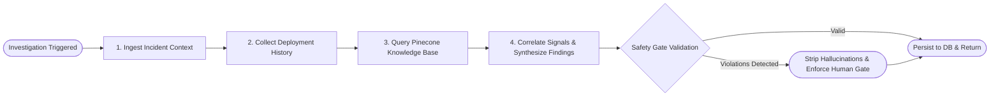

# OpsPilot — AI & LangGraph Multi-Agent Architecture

## 1. Multi-Agent Design Overview

OpsPilot uses **LangGraph** to coordinate multi-agent investigations. Rather than using an unconstrained chatbot or autonomous agent that can wander into infinite loops, OpsPilot's investigation graph is a deterministic Directed Acyclic Graph (DAG) with strongly-typed state transitions.



---

## 2. Investigation State Schema (`InvestigationState`)

The state passed across all nodes in the graph is strictly typed:

```python
class InvestigationState(TypedDict):
    incident_id: int
    incident_data: dict[str, Any]
    events: list[dict[str, Any]]
    deployments: list[dict[str, Any]]
    rag_citations: list[dict[str, Any]]
    findings: list[dict[str, Any]]
    evidence_ids: list[int]
    status: str
    error: str | None
```

---

## 3. Specialized Graph Nodes

### Node 1: `analyze_incident`
- Fetches incident details and associated chronological events from PostgreSQL.
- Normalizes alerts, timestamps, affected services, and severity levels.
- Registers initial evidence records in `core.investigation_evidence`.

### Node 2: `collect_deployments`
- Uses `GetRecentDeploymentsTool` to inspect CI/CD events within a 2-hour window preceding the incident.
- Correlates commit SHAs, author identity, and environment configurations.
- Identifies suspect release candidates (e.g. commit `9f2c4a1`).

### Node 3: `search_runbooks`
- Uses `SearchKnowledgeTool` with the user's `KnowledgeAccessContext`.
- Emits dense vector queries against Pinecone.
- Enforces an empirical similarity threshold of **`0.65`**.
- Verifies team ownership metadata to prevent cross-team information leakage.

### Node 4: `synthesize_findings`
- Aggregates operational signals from the preceding steps.
- Uses configured LLM provider (`Google Gemini 2.5 Flash`) with structured output enforcement (`response_schema=IncidentIntelligenceResult`).
- Automatically falls back to the deterministic rules engine if external LLM times out or returns malformed JSON.

---

## 4. Deterministic Tool Registry

Every tool conforms to the `BaseTool` interface:
```python
class BaseTool(ABC):
    name: ClassVar[str]
    description: ClassVar[str]
    args_schema: ClassVar[type[BaseModel]]

    def run(self, raw_input: dict[str, Any]) -> ToolResult:
        # 1. Pydantic schema validation
        # 2. Execution time tracking
        # 3. Encapsulation of crashes in ToolResult(status="FAILED")
```

### Registered Tools
| Tool Name | Input Schema | Purpose |
| :--- | :--- | :--- |
| `get_incident_details` | `GetIncidentInput` | Queries incident metadata and current status |
| `get_recent_deployments`| `GetRecentDeploymentsInput` | Fetches release history for affected services |
| `search_knowledge` | `SearchKnowledgeInput` | Executes grounded vector search on Pinecone |
| `get_incident_events` | `GetIncidentEventsInput` | Retrieves chronological telemetry events |

---

## 5. Fail-Closed Safety Gate (`IntelligenceSafetyGate`)

Before any intelligence output is persisted or displayed, it must pass through the `IntelligenceSafetyGate`:

```text
                               Candidate Intelligence Result
                                             │
                                             ▼
                 ┌───────────────────────────────────────────────────────┐
                 │       Rule 1: Are all cited evidence IDs valid?       │
                 └───────────────────────────┬───────────────────────────┘
                                             │ YES
                                             ▼
                 ┌───────────────────────────────────────────────────────┐
                 │    Rule 2: Are all cited evidence IDs authorized?     │
                 └───────────────────────────┬───────────────────────────┘
                                             │ YES
                                             ▼
                 ┌───────────────────────────────────────────────────────┐
                 │ Rule 3: Do all recommended actions require approval?  │
                 │              (requires_human_approval=True)           │
                 └───────────────────────────┬───────────────────────────┘
                                             │ YES
                                             ▼
                 ┌───────────────────────────────────────────────────────┐
                 │   Rule 4: Does operational decision require approval? │
                 │              (requires_human_approval=True)           │
                 └───────────────────────────┬───────────────────────────┘
                                             │ YES
                                             ▼
                                     VALIDATED & PERSISTED
```

If any rule fails:
- Hallucinated evidence IDs are pruned.
- Unapproved actions have `requires_human_approval` forced to `True`.
- If zero empirical evidence exists, root-cause confidence is capped at `0.60`.
