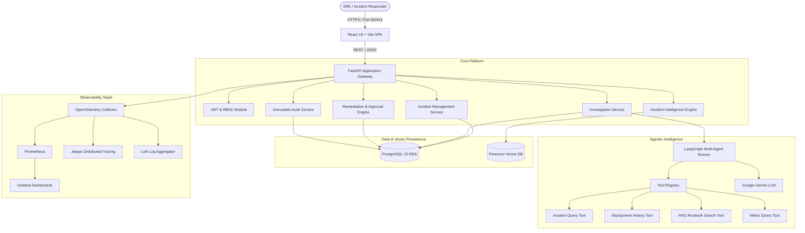
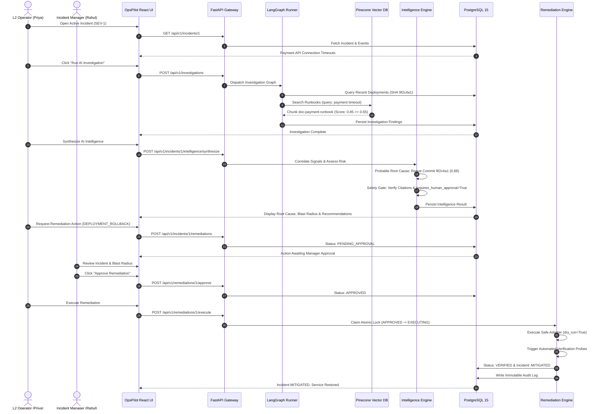

# OpsPilot — Comprehensive System Architecture

## 1. System Vision & Design Philosophy

OpsPilot is an AI-powered autonomous operations and incident response platform designed to assist Site Reliability Engineers (SREs), DevOps teams, and Incident Responders.

The design is governed by three foundational tenets:
1. **Deterministic Multi-Agent Coordination:** Large Language Models (LLMs) are used for synthesis, semantic correlation, and contextual reasoning, while state transitions, data fetching, and tool executions are strictly deterministic.
2. **Fail-Closed Evidence Grounding:** An AI recommendation is never trusted without empirical proof. Every factual claim must cite an empirical evidence ID or grounded runbook chunk. Hallucinations are actively filtered by an automated safety gate.
3. **Strict Separation of Operational Duties (Human-in-the-Loop):** Autonomous actions that alter production state (rollbacks, pod restarts, configuration overrides) are gated by role-based human approval and atomic idempotency locks.

---

## 2. High-Level C4 Container Architecture

---

## 3. End-to-End Incident Lifecycle Sequence

---

## 4. Subsystem Specifications

### 4.1 FastAPI Application Gateway
- **Middleware Pipeline:**
  - `RequestObservabilityMiddleware`: Injects correlation UUID (`X-Request-ID`), traces latency, and records Prometheus HTTP request counts.
  - `SecurityHeadersMiddleware`: Enforces `X-Frame-Options: DENY`, `X-Content-Type-Options: nosniff`, and `Strict-Transport-Security`.
  - `RateLimitMiddleware`: Sliding window in-memory limiter guarding against brute-force and request abuse.
  - `CORSMiddleware`: Whitelisted cross-origin resource sharing.
- **Exception Sanitization:** Global exception handlers mask passwords, database URLs, and API tokens from all API outputs.

### 4.2 LangGraph Multi-Agent Orchestration
- **State Definition (`InvestigationState`):** Strongly typed state object tracking incident metadata, accumulated evidence IDs, tool call traces, and agent findings.
- **Node Execution Flow:**
  1. `analyze_incident`: Ingests initial telemetry and events.
  2. `collect_deployments`: Queries CI/CD and deployment logs within the incident time window.
  3. `search_runbooks`: Queries Pinecone with verified team access context.
  4. `synthesize_findings`: Generates structured operational findings.
- **Deterministic Tool Registry:** Every tool inherits from `BaseTool`, validates inputs with Pydantic schemas, and encapsulates unhandled tool crashes in `ToolResult(status="FAILED")`.

### 4.3 Incident Intelligence & Decision Engine
- **Correlation Engine:** Computes temporal and semantic alignment across alerts, events, deployments, and runbooks.
- **Root Cause Engine:** Generates ranked candidate root causes with confidence scores, supporting evidence, and contradicting signals.
- **Impact Assessment:** Evaluates service degradation, operational scope, and customer impact.
- **Operational Decision Engine:** Recommends prioritized actions with strict human approval flags.
- **Fail-Closed Safety Gate:** Validates evidence grounding, strips hallucinated IDs, and rejects any action attempting to bypass human approval.

### 4.4 Remediation & Verification State Machine
- **State Lifecycle:**
  `PENDING_APPROVAL` ➔ `APPROVED` ➔ `EXECUTING` ➔ `COMPLETED` ➔ `VERIFIED`
- **Idempotent Concurrency:** Atomic database check-and-set locks prevent duplicate execution claims.
- **Adapter Whitelist:** Only predefined adapters (`DEPLOYMENT_ROLLBACK`, `RESTART_SERVICE_INSTANCE`, `ADJUST_POOL_LIMITS`, `RUNBOOK_STEP_EXECUTION`) can be dispatched. Shell injections are impossible.
- **Automated Verification:** Probes readiness endpoints and error rate metrics. If probes fail, status transitions to `VERIFICATION_FAILED` and the incident is NOT mitigated.
