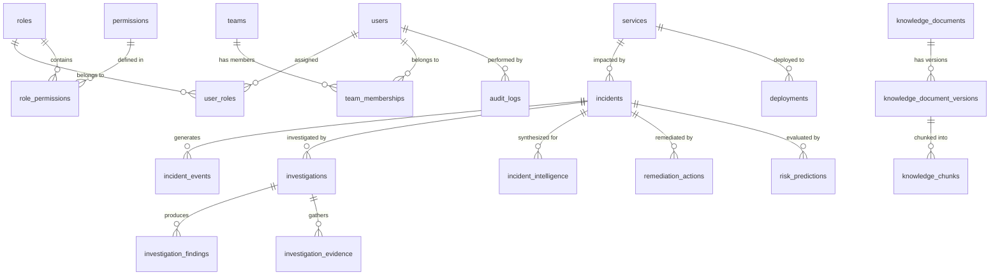

# OpsPilot — Relational Database Architecture & Schema Reference

## 1. Relational Database Overview

OpsPilot uses **PostgreSQL 15** with all application tables isolated inside the `core` schema. The database enforces relational integrity through strict foreign keys, unique indexes, and domain-level check constraints.

---

## 2. Entity Relationship Diagram (ERD)



---

## 3. Core Tables & Schemas

### 3.1 Authentication, RBAC & Organization
1. **`core.users`**: System user accounts (email, hashed password with Argon2, active status).
2. **`core.roles`**: Standard operational roles (`L1_TRIAGE`, `L2_OPERATOR`, `INCIDENT_MANAGER`, `ADMIN`).
3. **`core.permissions`**: Granular capability permissions (`INCIDENT_VIEW`, `ACTION_REQUEST`, `ACTION_APPROVE`, `ROLE_MANAGE`, `RUNBOOK_SEARCH`).
4. **`core.role_permissions`**: Mapping of permissions to roles.
5. **`core.user_roles`**: Mapping of roles to users.
6. **`core.teams`**: Engineering and operational teams (`Platform`, `Payments`, `Billing`, `Infrastructure`).
7. **`core.team_memberships`**: User-to-team assignments for document access isolation.

### 3.2 Incident Management & Operational Telemetry
8. **`core.services`**: Monitored service fleet (`payment-api`, `auth-service`, `order-processor`, `notification-service`).
9. **`core.incidents`**: Incident records tracking title, description, severity (`LOW`, `MEDIUM`, `HIGH`, `CRITICAL`), status (`DETECTED`, `ACTIVE`, `INVESTIGATING`, `MITIGATED`, `RESOLVED`, `CLOSED`), and assigned teams.
10. **`core.incident_events`**: Chronological event timeline (alerts, errors, threshold violations, mitigating actions).
11. **`core.deployments`**: Deployment history tracking git commit SHA, service, environment, trigger type, and status.
12. **`core.tickets`**: Cross-referenced issue tracking tickets.

### 3.3 Agentic Investigation & Evidence Persistence
13. **`core.investigations`**: LangGraph investigation sessions linked to incidents, tracking execution status, started/completed timestamps, and graph metadata.
14. **`core.investigation_findings`**: Structured findings generated by investigation tools.
15. **`core.investigation_evidence`**: Normalized operational evidence items gathered during investigations. Enforces check constraint `ck_investigation_evidence_type` (`INCIDENT`, `LOG`, `METRIC`, `DEPLOYMENT`, `RUNBOOK`, `KNOWLEDGE_BASE`, `SYSTEM`).

### 3.4 Knowledge Base & RAG Chunking
16. **`core.knowledge_documents`**: Runbooks and operational procedures with team ownership metadata.
17. **`core.knowledge_document_versions`**: Version history of operational runbooks.
18. **`core.knowledge_chunks`**: Text chunks with Pinecone vector IDs, token counts, and chunk hashes.

### 3.5 Intelligence, Risk & Remediation Lifecycle
19. **`core.incident_intelligence`**: Persisted intelligence synthesis results containing correlated signals, probable root causes, blast radius, and action recommendations.
20. **`core.risk_predictions`**: Machine learning risk scores evaluating escalation probability.
21. **`core.remediation_actions`**: Safe remediation requests tracking state (`PENDING_APPROVAL`, `APPROVED`, `REJECTED`, `EXECUTING`, `COMPLETED`, `VERIFIED`, `VERIFICATION_FAILED`), execution payloads, reviewer comments, and automated verification probe metrics.
22. **`core.audit_logs`**: Immutable audit records capturing every sensitive action, actor user ID, target resource, action result, and request ID.
23. **`core.schema_migrations`**: Migration tracking table ensuring sequential, idempotent schema updates.

---

## 4. Sequential Migration Scripts

The database is built sequentially from `db/migrations/`:
- `001_core_schema.sql`: Core schema, constraints, sequences, and tables.
- `002_core_seed_data.sql`: Seed data for roles, permissions, users, initial services, and incident #1.
- `017_knowledge_base.sql`: Knowledge document repositories, versioning, and chunk tracking.
- `018_investigation_evidence_knowledge_base.sql`: Knowledge base evidence associations.
- `019_incident_intelligence.sql`: Incident intelligence results persistence table.
- `020_remediation_actions.sql`: Human approval and safe remediation workflow tables.

Migrations are applied automatically via:
```bash
python scripts/run_migrations.py
```
