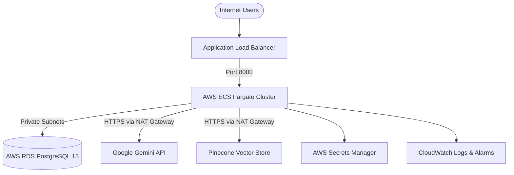

# OpsPilot — Production Deployment & Cloud Infrastructure Guide

This guide details the complete deployment process for OpsPilot across local Docker Compose and production AWS infrastructure.

---

## 1. Local Production Deployment (Docker Compose)

OpsPilot includes a complete, production-identical Docker Compose stack orchestrating all services, databases, and telemetry backends.

### Prerequisites
- Docker Engine 24+ & Docker Compose v2+

### Launching the Stack
```bash
# Clone and enter directory
git clone https://github.com/OpsPilot/OpsPilot.git
cd OpsPilot

# Launch in background with automatic build
docker-compose up -d --build
```

### Validating Running Containers
```bash
docker-compose ps
```
Expected output:
- `opspilot-postgres` (healthy, port 5432)
- `opspilot-backend` (healthy, port 8000)
- `opspilot-frontend` (healthy, port 80)
- `opspilot-otel-collector` (running, ports 4317/4318)
- `opspilot-prometheus` (running, port 9090)
- `opspilot-grafana` (running, port 3000)

### Accessing Endpoints
- **OpsPilot Operations UI:** `http://localhost/`
- **FastAPI API & Docs:** `http://localhost:8000/docs`
- **Grafana Observability Dashboards:** `http://localhost:3000/` (User: `admin`, Password: `admin`)
- **Prometheus Metrics:** `http://localhost:9090/`

---

## 2. AWS Infrastructure as Code (Terraform)

Located in `infra/terraform/`. Provisions an enterprise cloud architecture on AWS:



### Steps to Provision
1. Configure AWS CLI credentials:
   ```bash
   aws configure
   ```
2. Initialize Terraform:
   ```bash
   cd infra/terraform
   terraform init
   ```
3. Plan and apply infrastructure:
   ```bash
   terraform plan -out=tfplan
   terraform apply tfplan
   ```
4. Capture Terraform outputs:
   - `alb_dns_name`: Public URL for the ALB.
   - `rds_endpoint`: PostgreSQL connection string.
   - `backend_ecr_url`: ECR repository for container images.

---

## 3. GitHub Actions Automated CI/CD Pipeline

Continuous Integration and Deployment are automated via `.github/workflows/`:

### Continuous Integration (`ci.yml`)
- Trigger: Push / Pull Request to `main`.
- Jobs:
  1. `backend-test`: Runs flake8 linting, Bandit security scanner, and 349-test pytest regression suite against a PostgreSQL service container.
  2. `frontend-build`: Executes `npm ci` and `npm run build` on React SPA.
  3. `docker-build`: Tests building `backend/Dockerfile` and `frontend/Dockerfile`.

### Continuous Deployment (`deploy.yml`)
- Trigger: Merge to `main`.
- Steps:
  1. Authenticates via AWS OIDC Role.
  2. Builds and pushes Docker images with Git SHA tags to Amazon ECR.
  3. Executes database migrations: `python scripts/run_migrations.py`.
  4. Deploys to AWS ECS Fargate with zero-downtime rolling update (`minimum_healthy_percent = 100`).
  5. Runs post-deployment verification smoke tests: `python scripts/deploy_verify.py`.
  6. **Automated Rollback:** If smoke verification fails, `python scripts/rollback_ecs.py` automatically rolls back the ECS service to the previous stable revision.

---

## 4. Post-Deployment Smoke Verification & Rollback Runbook

### Run Smoke Test Manually
```bash
python scripts/deploy_verify.py --url http://YOUR-ALB-URL --retries 10 --delay 10
```
Verifies `/health`, `/db-health`, `/metrics`, security headers, and `/ui/`.

### Manual Rollback Procedure
If an issue is detected post-deployment:
```bash
python scripts/rollback_ecs.py \
  --cluster opspilot-production-cluster \
  --service opspilot-production-service \
  --target-task-def opspilot-production-app:PREVIOUS_REVISION_NUMBER
```
The script points the ECS service to the designated stable revision, forces a new deployment, and waits for container health stabilization.
